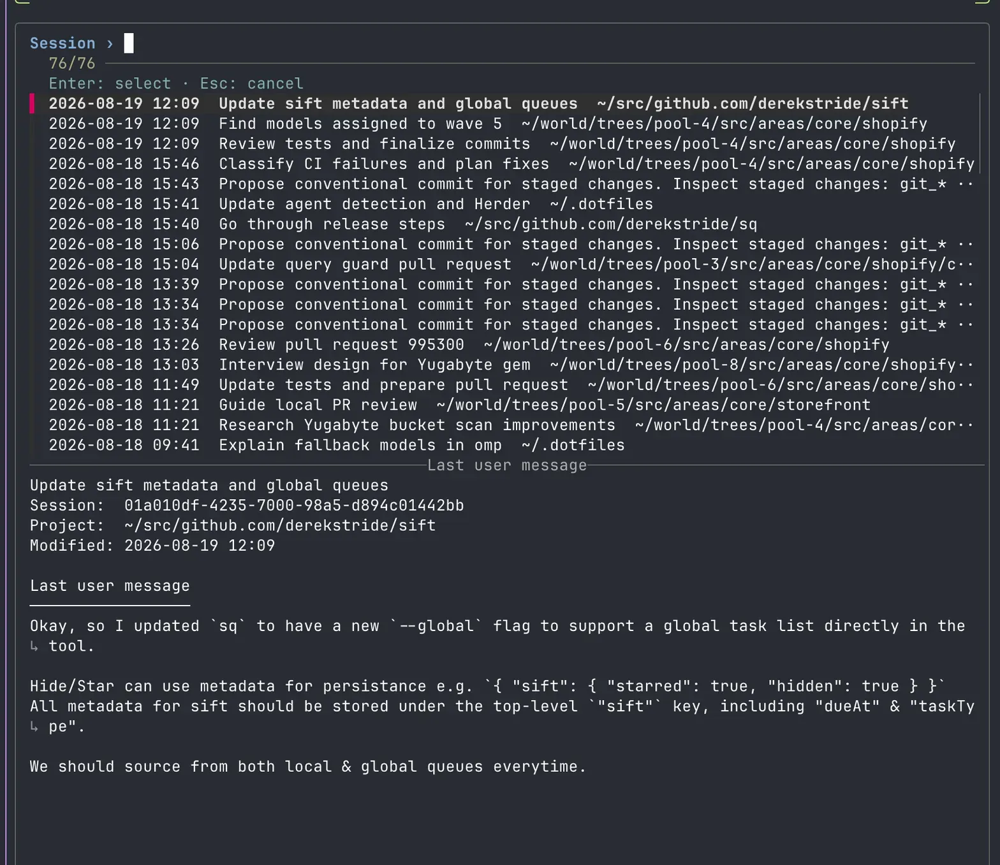
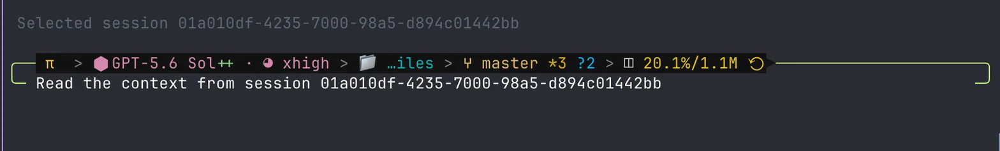

# omp-session-picker

An [fzf](https://github.com/junegunn/fzf)-backed session picker for [OMP](https://omp.sh). Browse persisted sessions, preview the latest user message, and prepare a prompt that asks the current agent to read the selected session's context.



Selecting a session restores OMP and prepares the prompt without submitting it, so it can be edited first.



## Requirements

- OMP 17.3 or newer
- `fzf` available on `PATH`

## Install

```sh
omp plugin install github:DerekStride/omp-session-picker --scope user
```

Restart any running OMP sessions after installation.

## Use

1. Run `/session-context` from an interactive OMP session.
2. Type to fuzzy-search session titles and project paths. The current session is excluded.
3. Review the latest user message in the preview window.
4. Press Enter to select, or Escape to cancel.
5. Edit or submit the prepared prompt: `Read the context from session <session-id>`.

## Development

```sh
git clone https://github.com/DerekStride/omp-session-picker.git
cd omp-session-picker
bun install
omp plugin link . --scope user
```

Run the checks with:

```sh
bun test
bun run typecheck
```

The extension uses OMP's session listing API, reads session JSONL files backward to find the latest user message, and hands the terminal to the `fzf` executable while the picker is open.

## License

[MIT](LICENSE)
