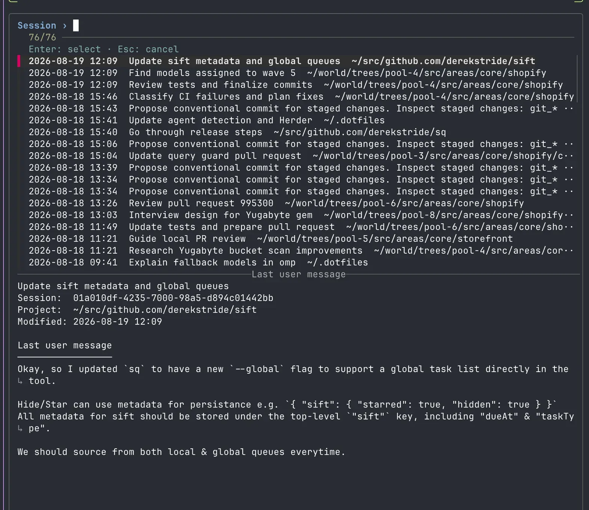
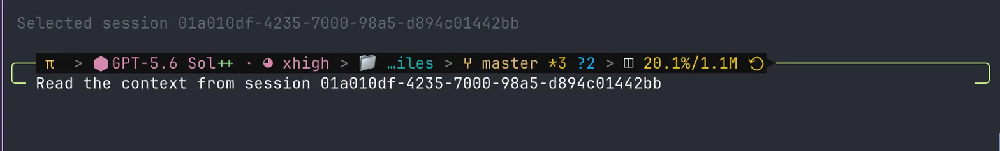

# omp-session-picker

An [fzf](https://github.com/junegunn/fzf)-backed session picker for [OMP](https://omp.sh) and [Pi](https://pi.dev). Browse persisted sessions, preview the latest user message, and prepare a prompt that asks the current agent to read the selected session's context.



Selecting a session restores the host and prepares the prompt without submitting it, so it can be edited first.



## Requirements

- OMP 17.3 or newer, or Pi 0.99 or newer
- `fzf` available on `PATH`
- Optional: [`agent-id`](https://github.com/DerekStride/agent-id-cli) available on `PATH` for human-readable session slugs and active-session filtering

## Install

OMP:

```sh
omp install github:DerekStride/omp-session-picker
```

Pi:

```sh
pi install git:github.com/DerekStride/omp-session-picker
```

For a local checkout, use `pi install /path/to/omp-session-picker`. Pi loads the directory in place without copying it or creating a symlink.

Restart or reload any running sessions after installation. To try the extension once without changing settings, pass the entrypoint directly: `pi -e /path/to/omp-session-picker/index.pi.ts`.

## Use

1. Run `/session-context` from an interactive session, or press `Alt+S` while editing a prompt.
2. Type to fuzzy-search Herdr workspace/tab names, session slugs (when available), titles (Pi session names or OMP titles, falling back to the first message), and project paths. The current session is excluded.
3. Review the latest user message in the preview window.
4. Press Enter to select, or Escape to cancel.
5. Continue editing or submit the prompt.

`Alt+S` inserts the selected session's human-readable slug at the current cursor position, falling back to its session ID when no slug is available. `/session-context` appends `Read the context from session <slug-or-id>` to the draft. Neither submits the prompt; Escape leaves the draft unchanged.

For tools that require a session ID, `agent-id lookup <slug> --json` returns it in the `session_id` field.

When available, the first Herdr `workspace / tab` location leads each result, followed by the title and project path. Agent slugs and additional locations remain searchable, and the preview shows all labels. Duplicate pane locations are collapsed.

With `agent-id`, the picker opens in **Active** view. Press `Ctrl+A` to toggle between **Active** and **All** without clearing the search query, including when Active is empty.

Active follows `agent-id discover`: non-stopped registered sessions, limited to live Herdr sessions when that information is available. All includes stopped and unregistered sessions.

If `agent-id` is missing or active discovery fails, the picker opens in All with title and path search.

## Development

```sh
git clone https://github.com/DerekStride/omp-session-picker.git
cd omp-session-picker
bun install
omp plugin link . --scope user   # OMP
pi install "$PWD"                # Pi
```

Run the checks with:

```sh
bun run test:omp
bun run test:pi
bun run typecheck
```

The extension uses the host's session listing API, reads session JSONL files backward to find the latest user message, and hands the terminal to the `fzf` executable while the picker is open. See `AGENTS.md` for the host adapter layout and contributor rules.

## License

[MIT](LICENSE)
